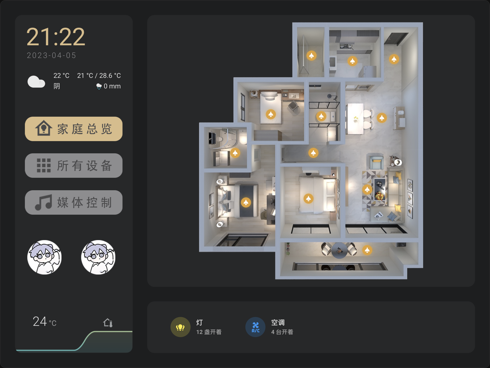

这是一个基于HomeAssistant的智能家居控制系统研究项目

------


# 一、HomeAssistant

## 1.1 介绍

> 谷歌解释：Home Assistant is an open-source home automation platform that focuses on privacy and local control.

是一个开源的家庭自动化控制管理平台。（这里就存在一个限制，一个HA只能用于一个家庭）


## 1.2 用途

目前我们想要远程控制家里的电器等设备，首先需要购买智能家居，而智能家居市场上存在许多家居生态（米家、天猫、homekit、博联…），但他们质量层次不齐，并且各自有自己的协议，不同生态之间并不互通。因此购买的时候就会出现必须买同一家生态的设备的限制。
如果你全都要，那就可以用HA折腾折腾。HA可以作为桥梁，把市场上现有的生态集成到一起控制。被控制的设备不局限于市面上的，还可以是你自己买的wifi模块（esp8266）。


## 1.3. 结构

HA本质上分为三层：core、supervisor、OS。主要能为我们提供服务的东西就是core，其实就是个软件应用。supervisor是软件的管理层，有这一层我们才能安装Add-on（其他应用的总称，HA中的所有Add-on是和core平级运行的软件）。HAOS是官方搞出来的系统（基于Linux），这意味着你的设备就算连个操作系统都没有，它也能在上面运行。


# 二、HA和设备的搭建

## 2.1 HA的安装

HA是我们自己为自己提供的服务，需要像商家服务器那样准备一个服务器来搭载和运行HA，其实就是需要一个运行设备（NAS、软路由、树莓派、PC、root过的安卓手机、阿里云…），HA理论上可以安装在任何机器上，不过还是按[官方文档](https://www.home-assistant.io/installation/)的推荐比较稳。HA配置要求也不高，并且如果我们要一直使用它就需要机器一直开着，因此最好是有一个功耗很低很省电的设备来搭载HA。

由于这只是一个课题的研究项目，因此我选择了在Windows电脑上利用VMware Workstation虚拟机来安装HAOS，安装步骤参考官方文档。


> HA安装或者启动可能出现的问题
>
> - 如果启动失败或启动成功但无法访问，尝试重新启动，如果还是失败，则使用ha命令回滚备份
>   查看备份信息：ha backups
>   回滚备份：ha backups restore 版本号
>   查看帮助命令：ha --help
>
> - 如果启动出现错误：Error returned from Supervisor: System is not ready with state: setup，请耐心等待（半个小时左右），HA正在更新Supervisor，更新完成后输入bannner后即可正常运行
>
> - 如果正常启动后无法通过域名homeassistant进行访问，重新生成mac地址以获取新的ip即可（还是不行就多尝试几遍）


## 2.2 HA的使用

HA自带一个web界面的操控入口，安装完成并运行以后可以直接通过虚拟机的ip+8123端口访问HA的web界面。

如何通过互联网访问到你的ha控制页面呢？

- 如果是直接安装在像树莓派那样的服务器运行设备上，可以通过做内网穿透来实现互联网访问。

- 像本次课题的研究HA是安装在虚拟机上的，那可以通过在宿主机上安装一个反向代理服务器Nginx，请求发送到Nginx再发送到HA上，我就是用这种方式让小组内的成员可以共同开发HA。

  ```conf
  http {
      include       mime.types;
      default_type  application/octet-stream;
  
      sendfile        on;
  
      keepalive_timeout  65;
  
      # homeassistant websocket config
      map $http_upgrade $connection_upgrade {
          default upgrade;
          ''      close;
      }
  
      # HTTP server
      server {
          listen       80;
          server_name  ha.mojito.love;
  
          return 301 https://$host$request_uri;
      }    
  
      # HTTPS server
      server {
          listen       443 ssl;
          server_name  ha.mojito.love;
  
          ssl_certificate      certs/ha.mojito.love_bundle.crt;
          ssl_certificate_key  certs/ha.mojito.love.key;
  
          ssl_session_timeout  5m;
  
          ssl_protocols TLSv1.2 TLSv1.3;
  
          ssl_ciphers ECDHE-RSA-AES128-GCM-SHA256:HIGH:!aNULL:!MD5:!RC4:!DHE; 
          ssl_prefer_server_ciphers  on;
  
          location / {
              proxy_set_header Upgrade $http_upgrade;
  	        proxy_set_header Connection $connection_upgrade;
              proxy_pass http://homeassistant:8123;
          }
      }
  }
  ```

  **注意：Nginx需要配置HA的WebSocket请求才能正常访问**


## 2.3 虚拟化智能家居设备

由于我手头上只有小米台灯一个智能设备，如果这样的话课题的研究则无法进行下去。因此只能通过虚拟化设备解决这个问题，通过查阅资料，发现MacOS系统中有一款开发软件可以实现这个需求。下面是虚拟化智能家居设备的流程：

1. 如果没有苹果电脑，同样我们在虚拟机上安装MacOS系统。
2. 安装MacOS系统并启动后，需要安装一款开发工具：**Xcode**（Xcode的版本需要和MacOS系统版本对应）。
3. 在Xcode中安装一款插件：**HomeKit Accessory Simulator**，在这款插件上即可进行设备的虚拟。


这款插件是针对于苹果智能生态开发的，因此虚拟出来的设备只能是Homekit的设备，这些设备通过桥接的方式接入网络，HA能在同一网络下搜索到这些设备（Zigbee协议），输入对应的设备码即可完成设备的接入。


# 三、基于HA进行开发

## 3.1 UI美化

HA本身是可以作为控制端的，可以直接在这个界面上控制设备。HA的默认控制前端页面是比较简陋的，但提供了多种方法提供我们进行前端控制页面的美化，可以直接用配置文件编写，也可以使用HA自带的卡片元素等。

本项目的UI美化是参照B站视频进行开发的，为PC、Phone和Pad三端开发了三套样式，其中PC和Phone是利用自带的卡片元素，可以在任意的屏幕尺寸做到自适应化，而UI-Pad是根据我自己的iPad绘制的图片，因此图片尺寸大小需要自行调整。

效果图：

- UI-Pad

  

  

  

  

- UI-PC

  

- UI-Phone

  

需要在HACS插件商店中安装下面的前端组件或依赖：

- mini-graph-card
- Mushroom
- button-card
- Mini Media Player
- Xiaomi Vacuum Map Card
- Xiaomi Cloud Map Extractor
- card-mod
- iOS Themes - Dark Mode and Light Mode
- Weather Card
- Sun Card
- Config Template Card
- Homekit panel card
- Simple Weather Card
- card-tools
- Mushroom Themes
- 彩云天气
- Search Card
- Kiosk Mode
- Colorfulclouds Weather Card
- 云音乐
- Mushroom - Better Sliders

如果有些找不到或者安装不了的，可以复制我的 `config/www/community` 文件夹中对应的组件到你自己HA同样的文件夹中。

在 `UI-Pad` 和 `UI-PC&Phone` 文件夹中的yaml配置文件就是对应的UI配置文件，文件夹中有 `.psd` 文件的可以用PS打开绘制你自己的页面。


## 3.2 自动化

HomeAssistant接入不同类型不同协议的设备后，可以使用自带的场景自动化功能实现设备之间的联动。

HomeAssistant的场景自动化拥有很多自定义的功能，可以自行深入研究。


如果想实现自定义程度更高的自动化，可以使用HA自动化插件：Node-Red


## 3.3 语音控制

在HA中添加HomeKit集成，HomeKit集成可以访问已经接入HA的设备，利用桥接模式再接入到苹果的家庭中，就可以使用Siri语音助手控制所有的设备。


同时HA也支持其他的语音识别控制终端来进行控制，比如华为的小艺语音助手、小米的小爱同学，都可对家庭中的设备进行控制。


文章参考：[homeassistant 快速入门](https://blog.csdn.net/Evagarden/article/details/124502528)

UI美化感谢B站UP主的视频教程：

- [小帅同学Js](https://b23.tv/gn1YtsB)
- [Frankiesmall](https://b23.tv/5w7RuDM)
- [Jenny的智能生活](https://b23.tv/4sqFetA)